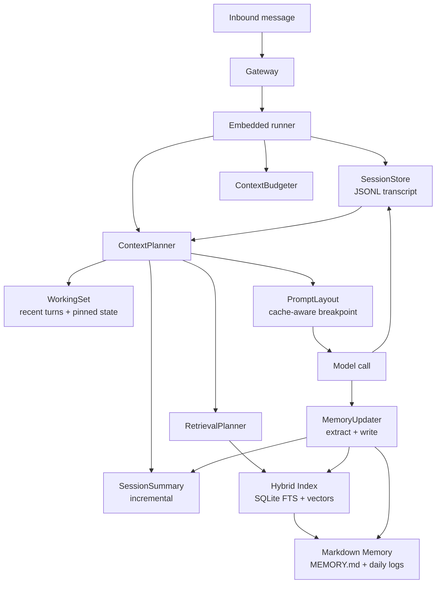

# A native, token-efficient memory system for OpenClaw

## Executive summary

OpenClaw already has most of the raw ingredients for durable memory: Markdown “source of truth” (daily logs plus an optional long‑term file), plus a per‑agent semantic index in SQLite with hybrid search and an embedding cache. citeturn11view0 It also has session compaction (summary persisted into JSONL) and session pruning (transient trimming of tool results, mainly to reduce prompt‑cache write costs after TTL expiry). citeturn9view0turn12view0

The weak link is not “no memory”, it is “memory and context are not budgeted as first‑class resources”. The current harness can still stuff too much into the model window (tool schemas, bootstrap files, long tool outputs, media inlining), and it still tends to compact late, when the session is already near the limit. citeturn12view3turn7search2turn6search30 When compaction fails, the system can fall back to a static “Summary unavailable…” placeholder, which is a full continuity break. citeturn7search20turn6search23

With Opus 4.6 pricing, late compaction and large re‑cache events are not a rounding error. Base input is $5/MTok, but cache writes are $6.25/MTok (5m) or $10/MTok (1h), cache hits are $0.50/MTok, and long‑context billing steps up once total input exceeds 200k tokens. citeturn13search11turn13search6 Prompt caching also only works if the cached prefix is identical up to the `cache_control` breakpoint. citeturn18search0turn18search2

This report proposes a native “memory kernel” layer that plugs into the existing embedded runner with small, surgical changes. It treats tokens, cache writes, and persistence writes as constrained budgets. It adds: a deterministic token budgeter, a multi‑tier memory model (working set → session summary → long‑term semantic memory), incremental background summarisation, retrieval planning with hard caps, and cache‑aware prompt layout.

Targets (design goals, not guarantees): cut steady‑state **input tokens** in long sessions by 40–70%, cut **cache‑write tokens** on “first message after idle” by 50–80%, and reduce “compaction wall” failures by doing incremental compaction before the window is tight. The system stays local‑first by default: Markdown remains the canonical memory store, SQLite remains the default index, and external vector DBs stay optional. citeturn11view0turn19search0

## Current OpenClaw memory and context pipeline

OpenClaw’s harness is a Node/TypeScript gateway that delegates agent runs to an embedded “Pi” runtime (via `@mariozechner/pi-*` packages) and persists transcript state to per‑agent JSONL files. citeturn21view0turn16view0turn17view0 The key memory‑relevant flows are below.

### Session persistence and transcript shape

Sessions persist as JSONL transcript files. The gateway reads those transcripts line‑by‑line, pushing `parsed.message` objects into in‑memory message lists. Compaction entries are stored as non‑message records, and the gateway fabricates a lightweight “Compaction” divider message for UI previews. citeturn17view0

The gateway resolves candidate transcript paths from session metadata and falls back to a legacy directory under `~/.openclaw/sessions`. citeturn17view0

### System prompt construction and context assembly

Each run rebuilds a system prompt that includes the tool list, tool schemas (JSON), skills metadata, runtime and time info, and injected workspace “bootstrap” files such as `AGENTS.md`, `TOOLS.md`, `SOUL.md`, etc. citeturn12view3turn16view0 The system caps per‑file injection (default 20,000 chars) and also caps total bootstrap injection (default 24,000 chars). citeturn12view3 OpenClaw explicitly calls out that tool schemas count toward the context window even though they are not visible as prompt text. citeturn12view3

In the embedded runner, the high‑level ordering is:

1) Build system prompt + “context files” from workspace. citeturn16view0turn12view3  
2) Open the session file via `SessionManager`, prepare it, then create an agent session. citeturn16view0  
3) Sanitize session history, validate provider turn rules, truncate history (DM/channel policies), then repair tool_use/tool_result pairings after truncation. citeturn16view0turn15view0  
4) Prompt the model (optionally injecting images into message content for vision‑capable models). citeturn16view0

This is “context as a reconstructed artefact”: the system prompt, tools, and injected files get rebuilt; the transcript gets re‑loaded; then filters/sanitizers may mutate it before each call. citeturn16view0turn12view3

### Existing memory mechanisms

OpenClaw memory is canonical Markdown in the workspace: `memory/YYYY-MM-DD.md` (append‑only daily log) and optional `MEMORY.md` (curated long‑term memory). The default behaviour reads today + yesterday at session start, and loads `MEMORY.md` only in the main/private session. citeturn11view0

Semantic memory search builds a per‑agent SQLite index (default `~/.openclaw/memory/<agentId>.sqlite`) with chunking (~400 token target, 80 token overlap), snippet text capped around ~700 characters, and hybrid scoring (BM25 + vector similarity). citeturn11view0 It can accelerate vector search using the `sqlite-vec` extension (a `vec0` virtual table). citeturn11view0turn19search0 OpenClaw also supports an embedding cache in SQLite so unchanged chunks don’t get re‑embedded. citeturn11view0

Session transcript indexing is explicitly “experimental” and opt‑in; it is debounced and asynchronous with delta thresholds (bytes or JSONL lines). citeturn11view0

Before compaction, OpenClaw can run a silent “memory flush” turn, prompting the model to write durable notes to disk (typically `memory/YYYY-MM-DD.md`), then return `NO_REPLY` so the user does not see it. It triggers when a token estimate crosses `contextWindow - reserveTokensFloor - softThresholdTokens`, and it is tracked “once per compaction cycle” in `sessions.json`. citeturn11view0

### Compaction vs pruning

Compaction summarises older conversation into a compact entry, persists that summary in the session JSONL, and keeps recent messages intact. citeturn9view0 Session pruning is different: it trims old tool results only in the in‑memory prompt right before a model call, and does not rewrite the transcript. citeturn12view0turn9view0

Pruning has a mode designed for Anthropic prompt caching economics: `cache-ttl` pruning runs when the last Anthropic call is older than `ttl`, specifically to reduce how big the first post‑TTL cache write is. It estimates tokens via `chars ≈ tokens × 4` and defaults to pruning only tool results, protecting the last few assistant messages. citeturn12view0

### Prompt caching mechanics in the Pi provider layer

Pi’s Anthropic provider explicitly supports `cache_control` markers with a “short/long/none” retention choice. For “long”, it uses `ttl: "1h"` only on `api.anthropic.com`. citeturn26view0 Pi’s OpenAI‑compatible provider also adds Anthropic‑style `cache_control` markers when routing Anthropic models through OpenRouter, by inserting a `cache_control: { type: "ephemeral" }` breakpoint on the last user/assistant text part. citeturn27view0

Claude prompt caching caches the entire prompt prefix—`tools`, `system`, then `messages`—up to and including the content block that contains `cache_control`. Cache hits require the prefix (including the cache marker placement) to be identical. citeturn18search0turn18search2 Tooling choices can also invalidate cached message blocks; the docs call out that changing `tool_choice` breaks caching for message content. citeturn18search1

## Deficiencies and cost drivers

This section is blunt because the failure modes show up repeatedly in the tracker and docs.

### Compaction often triggers late and can fail hard

OpenClaw’s own compaction docs describe auto‑compaction as something that triggers when the session is close to or exceeds the model window. citeturn9view0 In practice, multiple reports describe compaction happening around ~180k tokens (on 200k models) and then failing, leaving only a fallback summary string (“Summary unavailable due to context limits…”). citeturn7search20turn6search23 That failure wipes the usable conversational history unless the user has independently written durable state to files. citeturn6search23turn11view0

There are also reports of the session lane deadlocking after a compaction attempt times out, blocking further message processing until the gateway restarts. citeturn6search30

### Turn-count truncation is too crude and historically broke tool pairing

`limitHistoryTurns()` currently limits history by user‑turn count, not tokens, and slices message arrays based on the last N user turns. citeturn15view0 This has been implicated in orphaning tool_result blocks when the slice boundary removes the assistant tool_use but keeps the later tool_result, which then causes Anthropic API rejection (“unexpected tool_use_id”). citeturn14search2turn7search9

The embedded run attempt now explicitly re‑runs tool_use/tool_result pairing repair *after* truncation, acknowledging that truncation can orphan tool results. citeturn16view0 That is a patch, not a budgeted design: it still risks dropping the wrong semantic bits, and it does not optimise tokens, it just caps turns.

### Tool outputs and media can explode both context and disk

One issue states that the `exec` tool persists stdout/stderr verbatim to session JSONL transcripts, which both increases disk growth and makes it easy for large outputs to contaminate future contexts (unless pruned/compacted). citeturn6search2 Another report describes inbound audio attachments sometimes being inlined as raw bytes in session logs / model input, massively inflating prompt size and triggering context errors. citeturn6search18 The project itself discusses moving to “image_ref” blocks to avoid storing large base64 blobs in transcripts, which is the same underlying problem: binary payloads do not belong in the prompt. citeturn6search14

### System prompt overhead is real and persistent

OpenClaw’s `/context` breakdown shows that tool schemas can be several thousand tokens by themselves (and are always counted). citeturn12view3 Bootstrap files have caps, but large files still get partially injected each run, and truncation is by characters, not by token budget. citeturn12view3

### Opus 4.6 makes cache-write waste expensive

On Opus 4.6, cache writes cost more than base input tokens, and long-context pricing can double input cost once you exceed 200k input tokens (counting cache reads/writes as input). citeturn13search11turn13search6 That means “first request after cache TTL expiry” is exactly the moment you want to shrink cache‑write bytes, which is why OpenClaw’s session pruning is TTL‑aware and explicitly framed as a cache‑write reducer. citeturn12view0

But pruning only touches tool results, only affects the post‑TTL request, and only activates for Anthropic calls. citeturn12view0 It does not provide general context budgeting across providers or across content types (system prompt, injected files, conversation text, retrieval snippets, tool schemas).

### Retrieval exists, but it is not a strict budget allocator

Memory search is well‑documented (snippets only, chunked indexing, hybrid search), but it is not described as a token‑budget planner that arbitrates between “recent messages”, “summary”, “retrieval”, and “tools”. citeturn11view0turn12view3 Session memory indexing is experimental and can be stale by design, which is fine, but it does not solve “what is the cheapest set of context bits that keeps the agent on task?” citeturn11view0

## Patterns and best practices that work

The useful patterns are consistent across research and production docs: use tiers, summarise incrementally, retrieve surgically, and treat the prompt like a cacheable binary.

### Hierarchical memory and “paging” beats “stuff everything”

MemGPT frames the core problem as “virtual context management”: keep a small fast context (“RAM”) and page to/from slower persistent stores (“disk”) using retrieval and summarisation. citeturn20search0turn20search4 That maps cleanly to agent sessions: a working context window, plus durable stores on disk, plus an index for fast selection.

Stanford’s Generative Agents work makes the same point in a different domain: keep a complete log of experiences, periodically synthesise higher‑level reflections, then retrieve based on relevance/recency/importance at decision time. citeturn20search1 The scoring idea matters for OpenClaw because “most recent” is not always “most important”, and “important” should not mean “always in the prompt”.

### Retrieval‑augmented generation is a memory primitive, not a bolt‑on

The original RAG paper treats the retriever as a non‑parametric memory store that the generator queries at inference time. citeturn20search2turn20search6 In practice: keep long‑term information out of the prompt unless it is retrieved for the current problem, and cap that retrieved payload hard.

OpenClaw already implements hybrid retrieval (BM25 + vectors) and merges scores into a final ranking; the docs even sketch the scoring formula. citeturn11view0 The missing piece is: use that retrieval engine as a strict, cost‑aware allocator for context slots.

### Prompt caching only pays if you design for cache stability

Claude prompt caching caches the entire prefix up to a `cache_control` marked block, in `tools→system→messages` order. citeturn18search0 Cache hits require exact prefix identity. citeturn18search2 That means your “stable” content needs stable ordering and stable bytes, and your “dynamic” content needs to be pushed after the cache breakpoint.

The Claude docs also warn that changing `tool_choice` invalidates cached message blocks. citeturn18search1 Practically: keep tool choice stable in normal operation, and avoid injecting volatile content into the cached prefix.

Vendor guidance for caching says the same thing in different words: static content first, dynamic content last, and breakpoints placed at the end of the static portion. citeturn18search10turn18search0

### SQLite + lightweight vector extensions can stay local and fast

`sqlite-vec` exists specifically to provide small, “fast enough” vector search inside SQLite (`vec0` virtual tables) that runs wherever SQLite runs. citeturn19search0 OpenClaw already supports this path for memory search acceleration. citeturn11view0

OpenClaw also supports an optional “QMD” backend: a local search sidecar that combines BM25, vectors, and reranking locally. citeturn11view0turn19search1 That is useful as an optional “better retrieval without changing Markdown as truth”.

## Proposed architecture

The architecture below is intentionally conservative: it keeps Markdown as truth, keeps JSONL as the transcript log, keeps SQLite as the default index, and adds a small “planning and compaction kernel” in front of the model call.

### The core idea

Add a **Context+Memory Kernel** in the embedded runner that owns:

- A **token budget** per turn (context window minus reserves), rather than “N user turns”.
- A **tiered memory model**:
  - Working set (recent turns, small tool results, active task state)
  - Session summary (incrementally updated, compact, cacheable)
  - Long‑term memory (Markdown + semantic index)
  - Episodic archive (old transcript segments indexed but not stuffed)
- A **retrieval planner** that picks context addons under hard caps.
- A **cache layout manager** that makes cached prefixes stable and small enough to avoid painful cache writes.

### Component diagram



This fits the existing split between (a) transcript persistence and (b) memory files + index. citeturn17view0turn11view0

### What changes in the embedded runner

Today, the runner sanitises, validates, optionally truncates, and then calls `activeSession.prompt()`. citeturn16view0 The kernel introduces one consolidated “planContext()” step before the call and one “observeTurn()” step after.

Concretely, replace:

- Turn‑count truncation as the primary cap (`limitHistoryTurns()`) citeturn15view0  
with
- Token‑budget planning that can still *use* history limits, but only as a last resort.

### Cache-aware prompt layout for Opus 4.6

For Opus 4.6 cost control, the kernel designs prompts around two facts:

1) Cache writes cost more than base input. citeturn13search11  
2) Claude caches the entire prefix up to `cache_control`. citeturn18search0  

So the kernel makes the “cache prefix” contain:

- Tool schemas (stable, expensive to reprocess) citeturn12view3turn18search0  
- The system prompt text (stable) citeturn12view3  
- A **small session summary** that evolves slowly (so the cache prefix changes infrequently)

…and places volatile content (retrieval snippets, last user message, volatile tool outputs) *after* the cache breakpoint.

Pi’s Anthropic provider already supports `cache_control` and a 1h TTL option. citeturn26view0 The kernel should set retention to “long” only for workflows where the session round‑trip time often exceeds 5 minutes (long tool runs, extended thinking), because 1h cache writes are pricier. citeturn13search11turn18search9

### Trade-off table: compaction strategies

| Strategy | Context quality | Token/cost profile | Failure mode | My take |
|---|---|---|---|---|
| Reactive compaction when near limit (current default) | OK until it isn’t | Worst-case expensive (huge summarisation input) | Summary fails or stalls; user loses continuity | Too fragile; it fires when it is hardest citeturn7search20turn6search30 |
| Incremental summary every turn (small deltas) | Good (summary always fresh) | Predictable; can run on cheaper model | Summary drift if not validated | Best default; fixes the “late compaction” trap citeturn18search3turn20search0 |
| Retrieval-only, no summaries | Depends on retriever | Cheap per turn; can spike on broad retrieval | Misses “implicit state” unless stored | Works for Q&A, not for tool-heavy coding agents citeturn20search2turn11view0 |
| Background “instant compaction” (cookbook pattern) | Very good | Costs amortised; uses caching heavily | Complexity in concurrency/locks | Worth it for heavy sessions; pairs well with incremental summary citeturn18search3turn18search0 |

### Trade-off table: storage/index backends

| Backend | Deployment | Search quality | Operational cost | What it is good for |
|---|---|---|---|---|
| SQLite + FTS5 + optional `sqlite-vec` | Local, single-file | Good hybrid; “fast enough” vectors | Low | Default path; aligns with OpenClaw’s current index design citeturn11view0turn19search0 |
| QMD sidecar | Local, separate CLI | Strong: BM25 + vectors + rerank | Medium | “Better retrieval” without changing Markdown truth citeturn11view0turn19search1 |
| Postgres + pgvector | Server/managed | Strong; scales | Higher | Multi-user / shared memory, cross-host agents citeturn19search2turn19search6 |

## Implementation guidance

This section is written as if you are about to implement it inside `src/agents/pi-embedded-runner/run/attempt.ts`. citeturn16view0

### Kernel API and adapter points

Add a small interface that the runner calls:

```ts
// core interface: minimal surface area
type ContextPlan = {
  systemPrompt: string;              // may include cache-aware layout markers
  messages: AgentMessage[];          // final message list to send to model
  retrievalSnippets?: string[];       // optional: injected after cache breakpoint
  budgets: {
    contextWindow: number;
    reserveTokens: number;
    plannedInputTokens: number;
    plannedCacheWriteTokens?: number; // estimate, provider-specific
  };
  debug: {
    included: { kind: string; tokens: number; note?: string }[];
    excluded: { kind: string; tokens: number; reason: string }[];
  };
};

interface MemoryKernel {
  planContext(params: {
    sessionKey?: string;
    model: { provider: string; id: string; contextWindow: number };
    systemPrompt: string;
    transcriptMessages: AgentMessage[];
    workspaceDir: string;
    now: number;
  }): Promise<ContextPlan>;

  observeTurn(params: {
    sessionKey?: string;
    messagesAfter: AgentMessage[]; // what actually got persisted to JSONL
    usage?: { input: number; output: number; cacheRead?: number; cacheWrite?: number };
    now: number;
  }): Promise<void>;
}
```

Integration points in today’s runner:

- Right after `sanitizeSessionHistory()` and validation, instead of calling `limitHistoryTurns()` as the main cap. citeturn16view0turn15view0  
- Right before `activeSession.prompt(effectivePrompt)` so you can replace messages and append retrieval snippets in a controlled way. citeturn16view0  
- After the run completes, using Pi’s usage object (it tracks `input`, `output`, `cacheRead`, `cacheWrite` for Anthropic). citeturn26view0  

### Token accounting that does not lie

OpenClaw’s pruning system uses `chars ≈ tokens × 4` as an estimate. citeturn12view0 Keep that as a fallback, but prefer real counts:

- Claude’s platform has a token counting API; the release notes list it as a feature. citeturn18search7  
- Where you can’t count exactly, count conservatively and leave a safety margin.

A practical estimator:

- `token_estimate = ceil(utf8_bytes / 3.6)` for English‑heavy text (slightly safer than /4 chars, since UTF‑8 and punctuation exist).
- For JSON tool schemas and Markdown with code blocks, bias upward (code tokenises poorly).

### Context planning algorithm

The kernel should allocate budgets in this order, because these are the hard costs:

1) **Tool schemas + system prompt** (cannot be dropped if you want tools) citeturn12view3turn13search11  
2) **Working set**: last N turns by tokens, with tool_use/tool_result kept atomic  
3) **Session summary** (compact, structured)  
4) **Retrieval snippets** (hard cap, diversified)  
5) **Everything else** gets evicted or summarised

Pseudo-logic:

```ts
function plan(messages, systemPrompt, modelWindow, reserve) {
  const budget = modelWindow - reserve;

  // 1) Base cost: system prompt + tool schemas (already in systemPrompt)
  let used = count(systemPrompt);

  // 2) Working set: keep newest messages until we hit a working cap
  const workingCap = Math.floor(budget * 0.55);
  const working = takeFromEndByTokens(messages, workingCap, { atomicToolPairs: true });

  used += countMessages(working);

  // 3) Session summary: keep it small and structured
  const summaryCap = Math.min(1200, Math.floor(budget * 0.12));
  const summary = loadOrGenerateSummary(summaryCap);

  used += count(summary);

  // 4) Retrieval: cap by tokens AND by count
  const retrievalCap = Math.min(2000, budget - used);
  const snippets = retrieveAndPack({ cap: retrievalCap, maxItems: 6, diversify: true });

  used += countStrings(snippets);

  // 5) If we still exceed, shrink retrieval, then shrink working set, never shrink tools
  while (used > budget) { ... }

  return { working, summary, snippets };
}
```

Key property: this never “drops random mid‑history” the way a turn‑count slice can. `limitHistoryTurns()` exists today, but it is a blunt instrument and has been associated with tool pairing problems. citeturn15view0turn7search9

### Session summary format that stays token-light

Keep the summary as a fixed, compact schema that tokenises well and supports diffs. Example:

```md
[SESSION_SUMMARY v1]
goal: …
constraints: …
state:
  repo: …
  branch: …
decisions:
  - …
open_threads:
  - …
recent_artifacts:
  - file: …
    why: …
```

Why fixed keys matter: prompt caching requires exact prefix identity; stable summary structure reduces churn and shrinks cache writes. citeturn18search0turn13search11

### Incremental summarisation, not “summarise 180k tokens”

The kernel should update the summary every turn (or every K turns) using only the delta since the last summary checkpoint, not the full history. This is directly aligned with the “session memory compaction” cookbook concept: build session memory in the background so compaction is instant. citeturn18search3

Implementation sketch:

- Keep `summary_state.json` in the agent directory with:
  - lastProcessedTranscriptOffset (byte offset or entry id)
  - summaryText (current)
  - summaryEmbedding (optional)
- On `observeTurn`, append new transcript entries to a “delta buffer”.
- When delta buffer exceeds `X` tokens or `Y` seconds, run summariser on:
  - (current summary) + (delta buffer)
  - Output: updated summary + extracted durable facts (optional)
- Persist updated summary and reset delta buffer.

Make the summariser run on a cheaper model than Opus 4.6 by default. Opus 4.6 pricing makes sense for hard reasoning, not for “merge two bullet lists”. citeturn13search6turn13search11

### Retrieval planning that respects budgets

OpenClaw already has good chunking defaults and hybrid scoring. citeturn11view0 What you add is a packing step:

- Enforce `maxInjectedTokens`.
- Use MMR‑style diversification so you don’t inject six near‑duplicates (standard in retrieval tooling).  
- Strip low‑value tokens: long headings, repeated path footers, and boilerplate.

Also: keep retrieval snippets after the cache breakpoint. That keeps prompt caching stable even when retrieval results vary every turn. citeturn18search0turn18search2

### Disk writes: batch, reference, and dedupe

Three rules:

- Session JSONL should stay append‑only, but flush tool results safely (a missing tool_result write has been suspected in transcript repair incidents). citeturn14search8  
- Large tool outputs should never be persisted verbatim if they are not needed for later reasoning; at minimum they should be truncated before persistence, not only during pruning/compaction. citeturn6search2turn12view0  
- Media should be stored as files and referenced in transcripts (`image_ref`, `audio_ref`) instead of base64 in content blocks. The project has already discussed this direction for images. citeturn6search14turn6search18  

A minimal schema extension for transcripts:

```json
{ "type": "tool_output_ref",
  "toolCallId": "…",
  "path": "tool-output/2026-02-15/<id>.txt",
  "bytes": 1048576,
  "sha256": "…",
  "preview": "first 500 chars…" }
```

The model context then gets only the preview by default; full content is available via a read tool if needed.

### Prompt caching configuration defaults for Opus 4.6

Given how caching works (cache prefix up to `cache_control`), you want:

- `cache_control` placed at the end of stable content. citeturn18search0  
- Stable ordering of tools and system prompt. citeturn18search2  
- Avoid changing `tool_choice` across turns unless needed (it can invalidate cached message blocks). citeturn18search1  
- TTL selection:
  - 5m TTL is the default cheap option.
  - 1h TTL makes sense when tool runs, extended thinking, or workflows exceed 5 minutes frequently (the docs explicitly mention this for “thinking with prompt caching”). citeturn18search9turn26view0  

## Integration plan, tests, benchmarks, and metrics

### Integration sequence

| Phase | Change set | Outcome | Acceptance metric |
|---|---|---|---|
| Instrumentation | Enable cache-trace JSONL + per-turn token/cost logging (existing hooks) | Baseline data | You can chart input/output/cacheRead/cacheWrite by session citeturn24view0turn26view0 |
| Budgeted context planner | Replace “turn-limit as cap” with token budget planning; keep tool pairs atomic | Fewer overflows; less randomness | 0 “stopReason:length with empty reply” loops; lower p95 input tokens citeturn6search34turn15view0 |
| Incremental summary | Introduce persistent session summary state + delta processing | Compaction becomes rare and fast | Compaction success rate >99%; summary always present (no fallback text) citeturn7search20turn18search3 |
| Cache-aware layout | Move volatile retrieval after cache breakpoint; stable prefix for tools/system/summary | Higher cache hit rate; lower cache writes after idle | Cache hit ratio increases; cacheWrite tokens shrink on post-idle turns citeturn18search0turn12view0turn13search11 |
| Reference-based persistence | Store media/tool outputs as files; keep previews in transcript | Less disk growth; fewer context blowups | No base64 blobs in transcripts; max tool payload in prompt bounded citeturn6search14turn6search18turn6search2 |

### Tests

The tests need to match the observed failure modes.

- **Transcript validity property tests**: generate random sequences of tool_use/tool_result blocks, then run trimming/compaction, and assert “no orphan tool_result” and “roles alternate correctly” for Anthropic. This directly targets the class of issues attributed to truncation and repair ordering. citeturn14search2turn14search12turn16view0  
- **Budget planner tests**: fixed inputs where system prompt is large (tool schemas), and assert that the planner always respects `contextWindow - reserve`. OpenClaw’s docs enumerate what counts toward context. citeturn12view3turn9view0  
- **Compaction regression tests**: replay transcripts that previously produced “Summary unavailable…” and assert the incremental summary path produces a non-empty structured summary. citeturn7search20turn6search23  
- **Cache breakpoint stability tests**: given identical stable prefix, ensure the planner yields byte-identical cached prefix across turns when only retrieval changes. That is required for cache hits. citeturn18search0turn18search2  

### Benchmarks and metrics

Measure three things: tokens, latency, and writes.

Token metrics (per turn, and aggregated per session):

- `input_tokens`, `output_tokens`, `cache_creation_input_tokens` (cacheWrite), `cache_read_input_tokens` (cacheRead), and derived cost using model pricing. Pi’s Anthropic provider maps these fields and computes cost. citeturn26view0turn13search11  
- “First turn after idle TTL” cacheWrite spike size (before vs after). This is exactly what session pruning is meant to reduce today. citeturn12view0  
- Context composition percentages: system prompt, working set, summary, retrieval. OpenClaw already reports system prompt sizes via `/context`. citeturn12view3  

Latency metrics:

- p50/p95 time to first token and full completion.
- Compaction latency and timeout rate (there are reports of compaction timeouts jamming lanes). citeturn6search30turn18search3  

Memory footprint / IO metrics:

- JSONL bytes appended per turn (tool outputs dominate today). citeturn6search2turn17view0  
- Number of filesystem writes per turn (batching should reduce this).
- SQLite index update time per delta (memory docs describe async debounced indexing and embedding cache behaviour). citeturn11view0  

### A blunt cost sanity check for Opus 4.6

If you do nothing else, reduce cache writes. On Opus 4.6, a 5‑minute cache write costs $6.25/MTok and a 1‑hour cache write costs $10/MTok, while cache reads cost $0.50/MTok. citeturn13search11